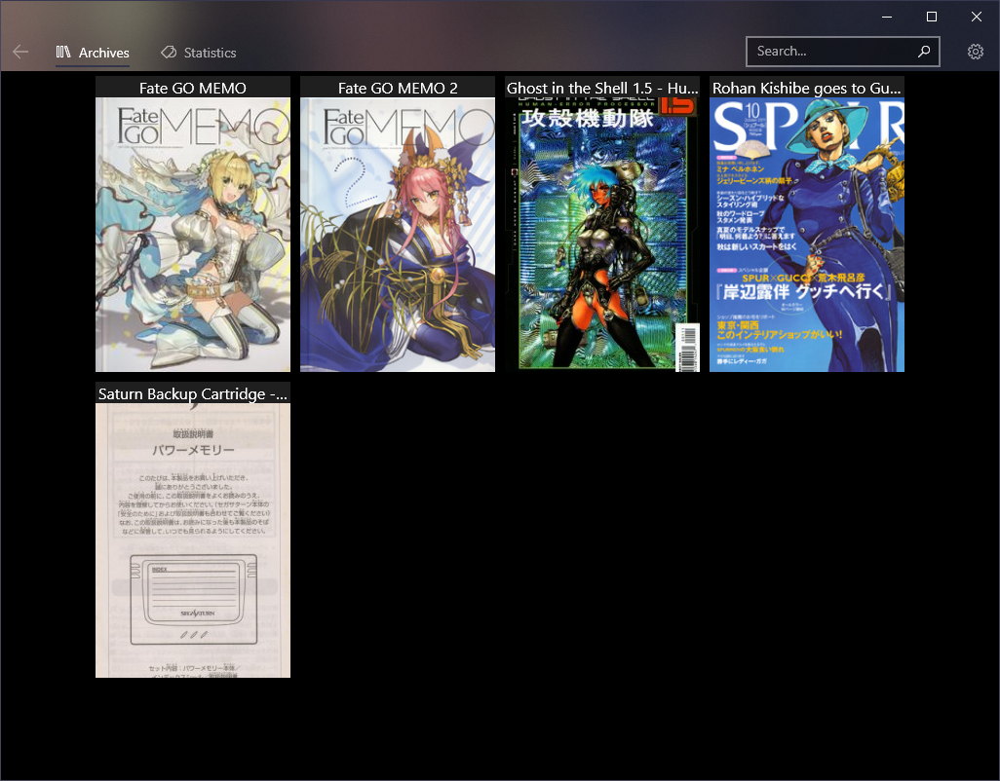
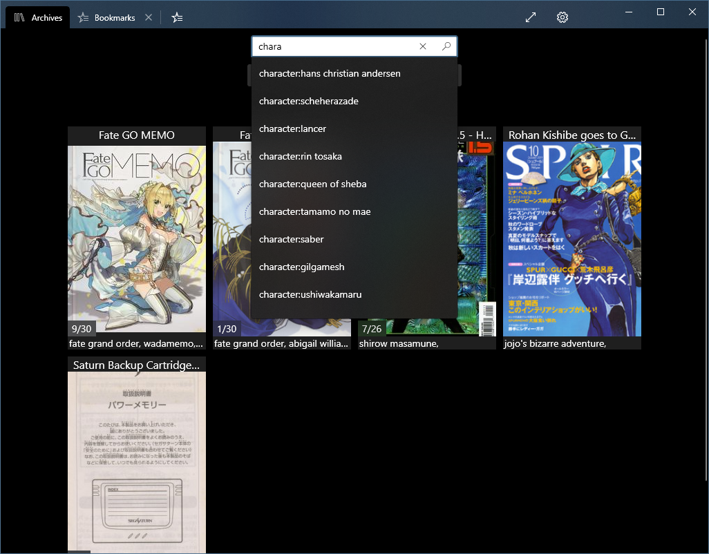
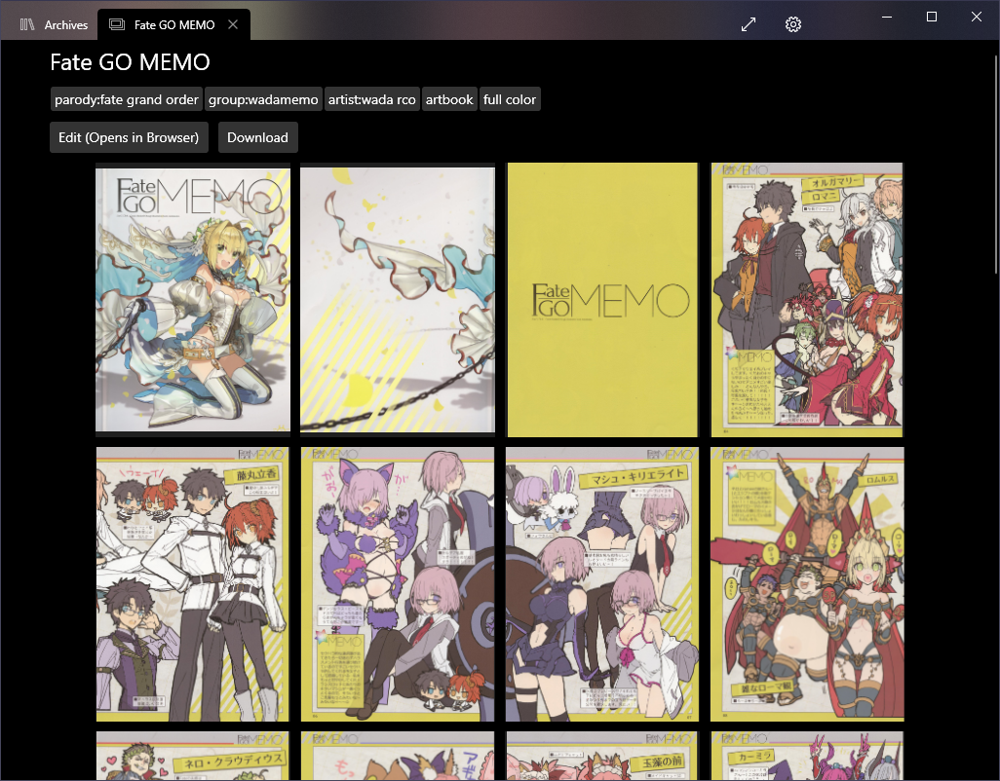
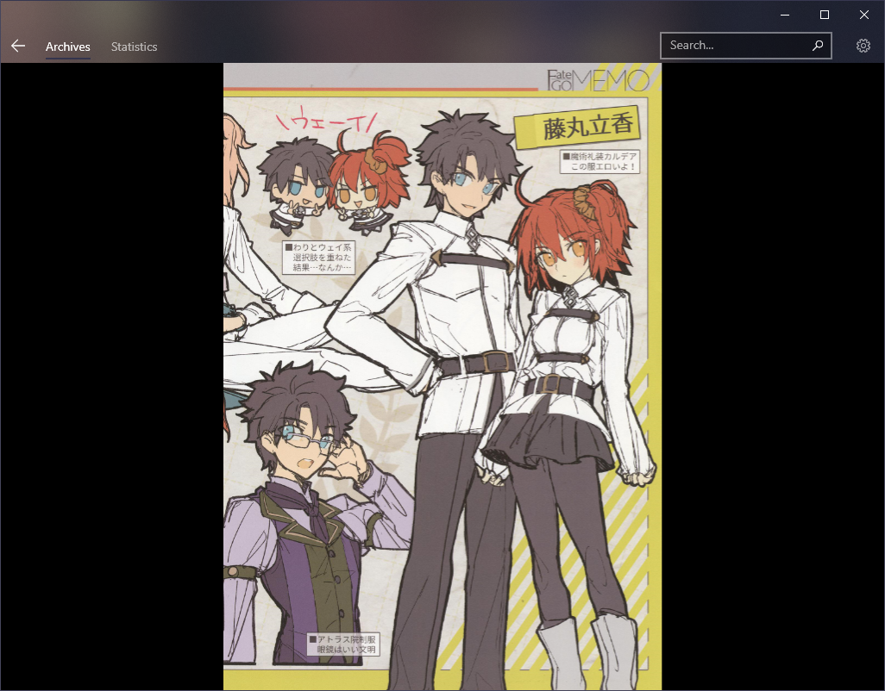
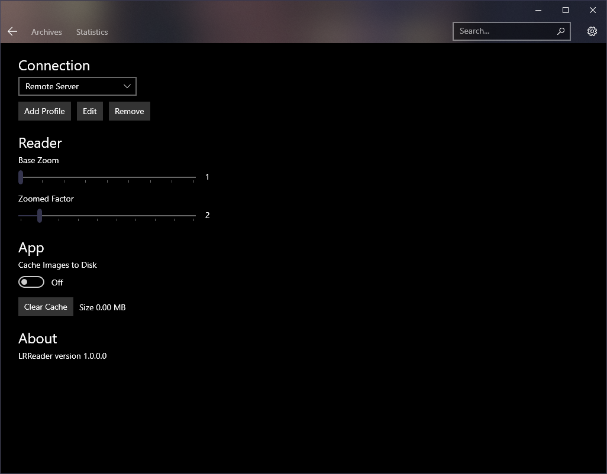

## Features
- Archives list.
- Search by name and/or tag.
- Show new archives only.
- Download archives.
- Archive overview (with tags) & reader.
- Configurable reader's base zoom and zoomed factor.
- Optional image caching.
- Multiple servers.
- Restart server's background worker.
- Clear "All New" flags.
- Download database.
- Fullscreen.

## Requirements

- Windows 10 1803 (x86, x64, ARM or ARM64)
- LANraragi v0.6.4

## Installing
Sideload only for now. 

### First time
Unzip and right click `Add-AppDevPackage.ps1` > Run with powershell 
This will add the self-signed certificate and install the app.

### Upgrade
Unzip and run the `LRReader_<version>_x86_x64_arm_arm64.appxbundle` file, the app installer should pop-up.

## Screenshots

 
 
 
 
 
