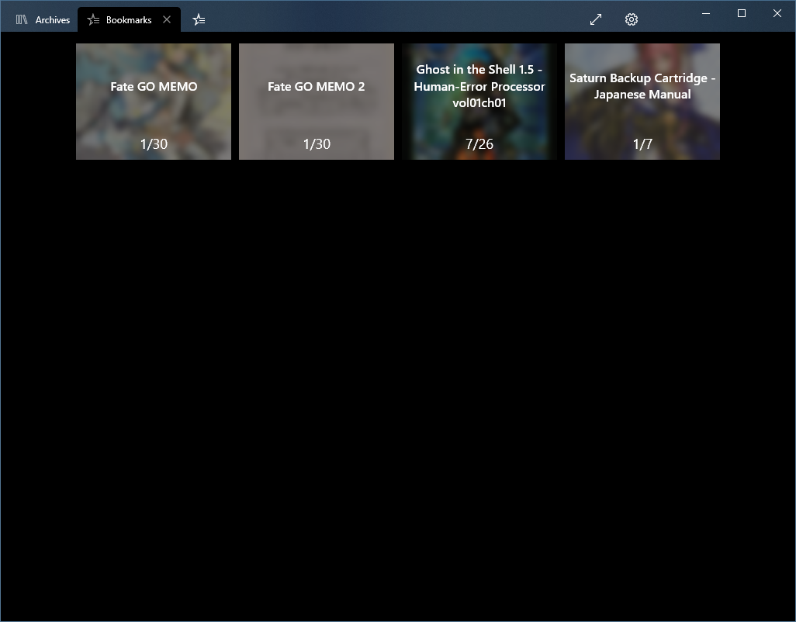
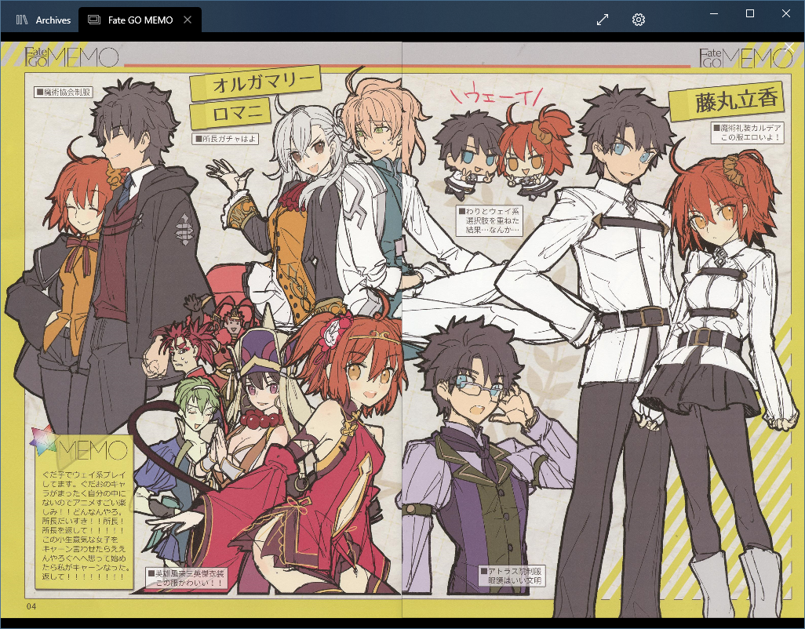

## Features
- Archives list.
- Search, the same one used in the webview.
- Show new archives only.
- Download archives.
- Archive overview (with tags) and reader.
- Configurable reader's base zoom and zoomed factor.
- Right-to-Left and Two pages modes.
- Bookmarks.
- Optional image caching.
- Multiple servers.
- Restart server's background worker.
- Clear "All New" flags.
- Download database.
- Fullscreen.

## Requirements

- Windows 10 1803 (x86, x64, ARM or ARM64)
- LANraragi v0.6.6+

## Installing
Sideload only for now. 

For stable check the [Releases page](https://github.com/Guerra24/LRReader/releases)

For nightly check the [Actions page](https://github.com/Guerra24/LRReader/actions?workflow=Continuous+Delivery)

### First time
Unzip and right click `Install.ps1` > Run with powershell 
This will add the self-signed certificate and install the app.

If you're using a local-hosted instance (e.g. LANraragi on Windows), you will need to run this command: 
`CheckNetIsolation loopbackexempt -a -n=Guerra24.LRReader_3fr0p4qst6948` 
To allow localhost access.

### Upgrade
Unzip and run the `LRReader.UWP_<version>_x86_x64_arm_arm64.appxbundle` file, the app installer should pop-up.

## Screenshots

 
 
 
 
 
 
 
